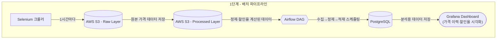
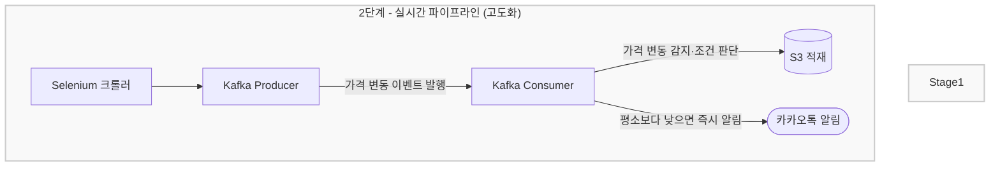

# 오늘 사도 될까? 🛒
> 쿠팡 생필품 가격 변동 감지 파이프라인

<br>

## 📌 프로젝트 배경

쿠팡에서 같은 생필품도 하루에 수차례 가격이 바뀐다.  
부모님은 세제, 휴지, 라면처럼 매달 반복 구매하는 품목을 언제 사야 가장 저렴한지 알 방법이 없었다.

가격 추적 서비스가 있지만 두 가지 한계가 있었다.  
원하는 제품을 일일이 검색해야 하고, 수집된 데이터를 내가 직접 분석에 활용할 수 없다.

이 프로젝트는 그 한계에서 시작됐다.  
생필품 카테고리에 특화된 가격 데이터를 직접 수집·적재하고,  
패턴을 분석하고, 변동을 실시간으로 감지한다.  
**데이터를 소유한다는 것, 그게 이 프로젝트의 출발점이다.**

<br>

## 🎯 해결하고자 한 문제

| 문제 | 해결 방법 |
|---|---|
| 수동으로 가격을 확인해야 하는 비효율 | Airflow 기반 자동 수집 파이프라인 |
| 가격 이력 데이터를 직접 보유·분석할 수 없음 | AWS S3에 원천 데이터 적재 및 소유 |
| 가격이 낮아지는 순간을 놓침 | Kafka 기반 실시간 변동 감지 + 카카오톡 알림 |

<br>

## 🏗️ 아키텍처




### S3 폴더 구조

```
s3://price-watch-sung/
├── raw/
│   └── 2026-04-01/
│       └── 14:00/
│           └── products.json
├── processed/
│   └── 2026-04-01/
│       └── products_cleaned.parquet
└── mart/
    └── discount_summary.parquet
```

<br>

## 🛠️ 기술 스택

### Language


### Cloud (AWS)


### Data Pipeline


### Database & Visualization


### Library
| 라이브러리 | 역할 |
|---|---|
| boto3 | Python ↔ AWS S3 연동 |
| Selenium | 쿠팡 가격 크롤링 (봇 차단 우회) |
| pandas | 데이터 정제·할인율 계산 |
| psycopg2 | Python ↔ PostgreSQL 연동 |
| python-dotenv | 환경변수 관리 |

### Notification


<br>

## 📂 프로젝트 구조

```
coupang-price-watch/
├── src/
│   ├── crawler/
│   │   └── coupang.py          # 쿠팡 가격 크롤러
│   ├── utils/
│   │   └── s3_uploader.py      # S3 업로드 유틸
│   ├── pipeline/               # Airflow DAG (예정)
│   └── streaming/              # Kafka Producer/Consumer (예정)
├── .env.example                # 환경변수 양식
├── .gitignore
└── requirements.txt
```

> 기능별 역할 분리로 유지보수성 확보.  
> 추후 쿠팡 외 다른 플랫폼 크롤러 추가 시 `crawler/` 안에 파일만 추가하면 됩니다.

<br>

## 🗓️ 개발 로드맵

```
[1단계 - 배치 파이프라인]       ← 진행 중
Week 1 : AWS 세팅 + 크롤러 작성 + S3 적재    ✅
Week 2 : 데이터 정제 + 할인율 계산 + 시각화  🔲
Week 3 : Airflow DAG + 스케줄링 자동화       🔲

[2단계 - 실시간 파이프라인 고도화]
Week 4 : Kafka Producer 구축                 🔲
Week 5 : Kafka Consumer + 조건 판단 로직     🔲
Week 6 : 카카오톡 알림 연동 + 전체 테스트    🔲
```

<br>

## ⚙️ 실행 방법

```bash
# 1. 레포 클론
git clone https://github.com/hyochangsung/coupang-price-watch.git
cd coupang-price-watch

# 2. 가상환경 생성 및 활성화
python3 -m venv venv
source venv/bin/activate  # Windows: venv\Scripts\activate

# 3. 패키지 설치
pip install -r requirements.txt

# 4. 환경변수 설정
cp .env.example .env
# .env 파일 열어서 본인 키 입력

# 5. 크롤러 실행
python src/crawler/coupang.py
```

<br>

## 📦 수집 품목

| 카테고리 | 품목 |
|---|---|
| 식품 | 신라면 멀티팩, 햇반 |
| 위생 | 3겹 화장지, 물티슈 |
| 세제 | 액체세제, 섬유유연제, 주방세제 |
| 생활 | 샴푸, 마스크 |

<br>

## 🔑 환경변수

`.env.example` 파일을 복사해서 `.env` 파일을 만들고 아래 값을 입력하세요.

```
AWS_ACCESS_KEY_ID=
AWS_SECRET_ACCESS_KEY=
AWS_REGION=ap-northeast-2
S3_BUCKET_NAME=
```
